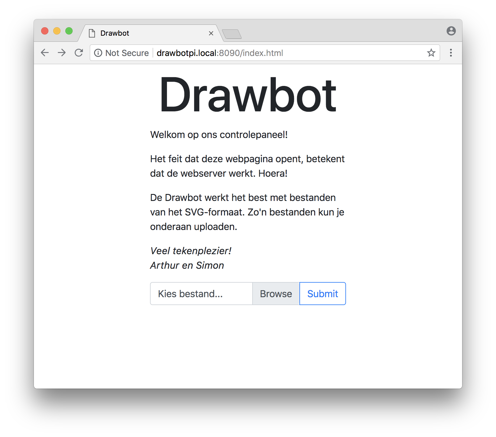
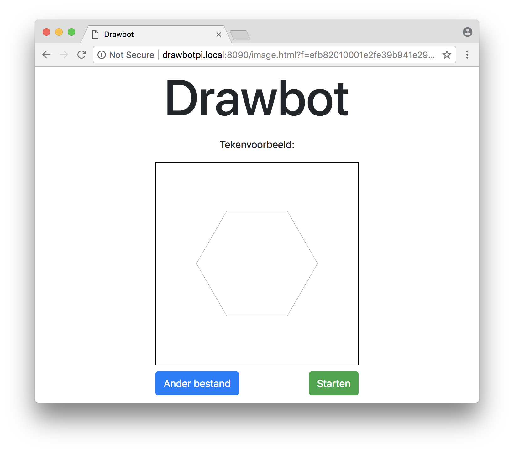
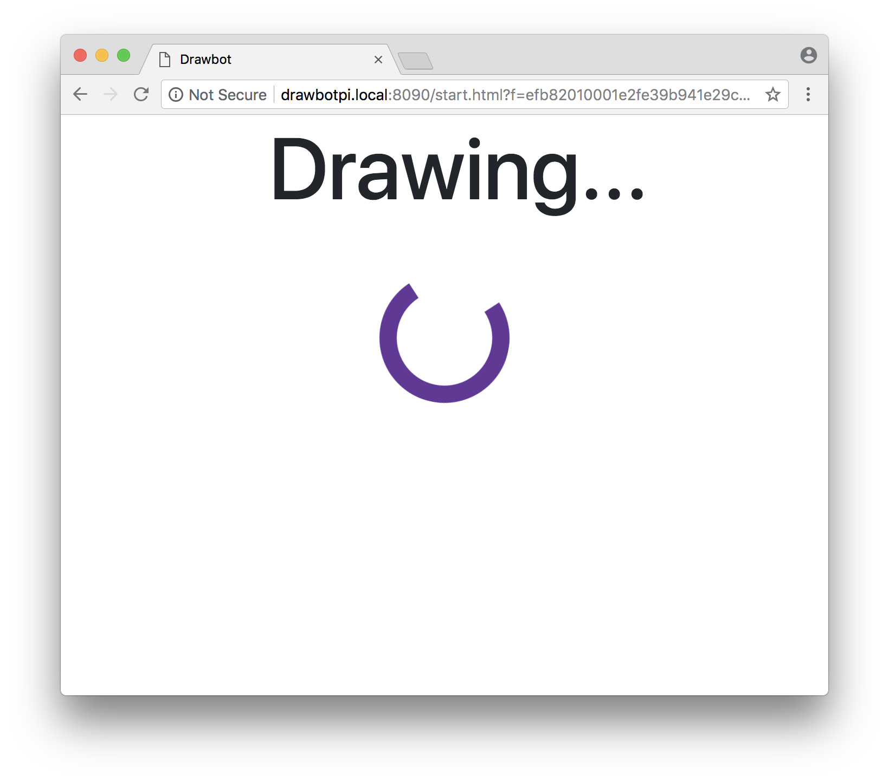

# Drawbot HTTP Interface

> A HTTP interface/webserver to upload and process SVG files for a [Kritzler-like](https://github.com/tinkerlog/Kritzler) drawing robot

Made as a school project by *[Simon](https://github.com/CandleShooter) & [Arthur](https://github.com/arthurvr)*, with lots of help from our amazing teachers. 


## Workflow








## Setup

We run the standard Arduino firmware combined with slightly modified hardware. Instead of connecting the Arduino to Processing and requiring the complex software setup, the Arduino is just connected to a Raspberry Pi Zero W running a Python webserver. The Arduino and the Raspberry Pi communicate using a serial interface. We run Arch Linux ARM on our Raspberry Pi, but in theory every OS should do. [Raspbian (lite)](https://www.raspberrypi.org/downloads/raspbian/) is a good choice if you've never installed a Raspberry Pi before.

You need Git, Python 3, [`pyserial`](https://pythonhosted.org/pyserial/) and [`pybars`](https://github.com/wbond/pybars3) (available on pip). After installing those, just clone the repo and enter the directory:

```
$ git clone https://github.com/VTIRoeselare/drawbot-interface.git webserver
$ cd webserver
```

Now change the `HOST` and `PORT` variables in `server.py` to your personal preference and network setup. Then, start the webserver:

```
$ python3 server.py
```

Starting the server might take a few seconds.

Please do consider this in BETA: **always stay with the robot while it's drawing**.


## SVG compatibility

The interface currently doesn't support the whole SVG standard, only a small fraction of it. Feel free to improve our software in a [PR](https://github.com/VTIRoeselare/drawbot-interface/pulls), though.

Even though we don't support all SVG tags, nearly all shapes are easily approximated by lines using standard graphics software. We like [Adobe Illustrator](https://www.adobe.com/products/illustrator.html) or [Inkscape](https://inkscape.org/en/).
